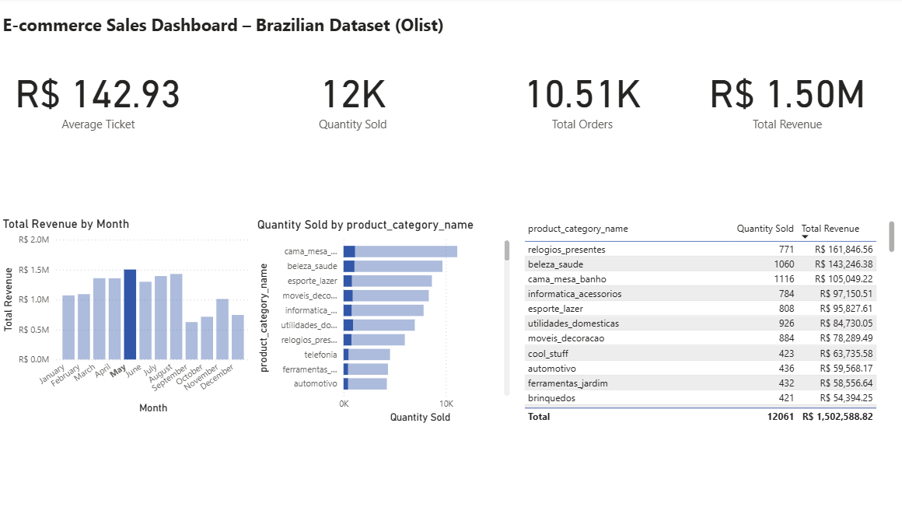
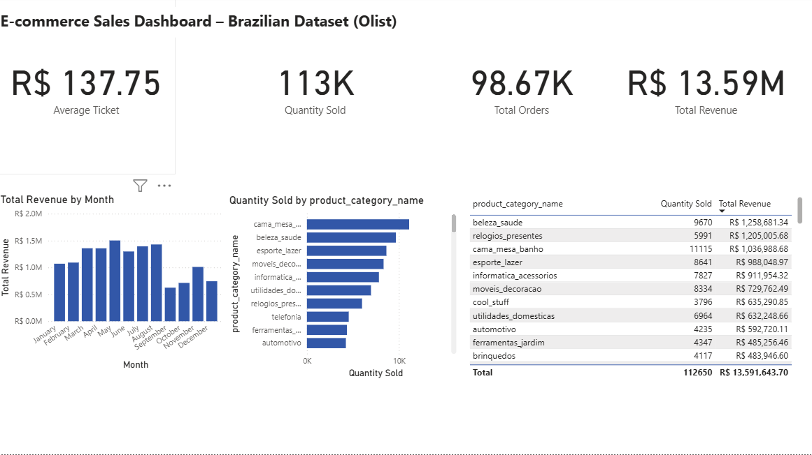
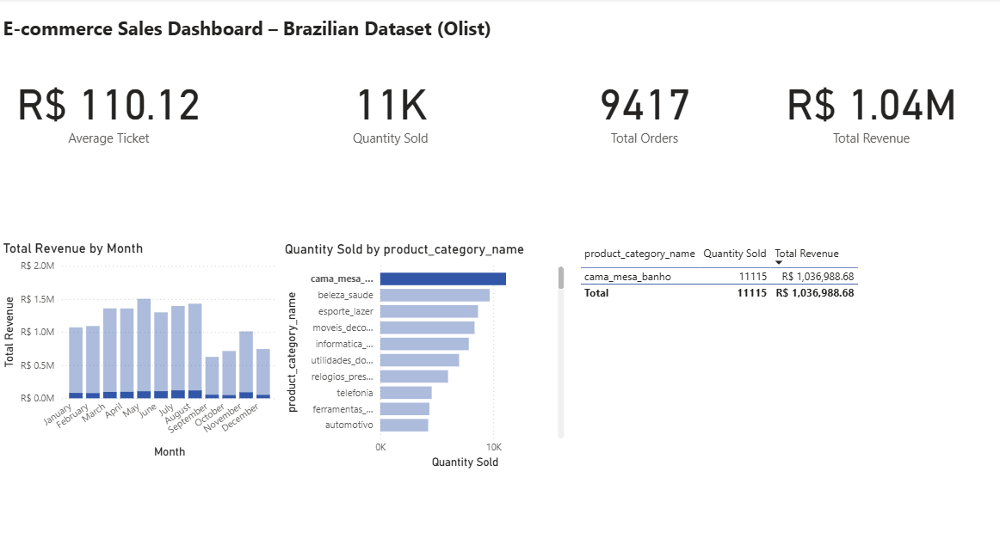

# 📊 Ecommerce Sales Analysis – Power BI Project

This project presents a dashboard created in Power BI using real data from a Brazilian e-commerce platform (Olist), available on Kaggle.  
The goal is to analyze sales performance, product demand, and revenue distribution across categories and time.

---

## 📁 Dataset Source  
[Kaggle – Brazilian E-Commerce Public Dataset by Olist](https://www.kaggle.com/datasets/olistbr/brazilian-ecommerce)

---

## 🎯 Key Metrics (KPIs)
- 💰 **Total Revenue:** R$ 13.59M  
- 📦 **Quantity Sold:** 113K  
- 🧾 **Total Orders:** 98.6K  
- 💳 **Average Ticket:** R$ 137.75  

---

## 📊 Dashboard Overview

This is the complete dashboard showing the KPIs and main visual analyses.

---

## 🔍 May Performance Deep Dive

In May, the total revenue reached **R$ 1.50M**, with an average ticket of **R$ 142.93**.  

This could indicate a **seasonal spike such as Mother's day** or a **strong campaign focused on home goods**, and it highlights the importance of tracking monthly category performance to identify strategic timing for promotions.

---

## 📋 Product Performance Table

Table showing quantity sold and total revenue by category, sorted by volume.

---

## 💡 Key Insights

- **Top Category by Quantity Sold:** cama_mesa_banho  
- **Top Category by Revenue:** beleza_saude  
- **Seasonal Peak:** June (followed by May and July)  
- **Average Ticket:** Consistently around R$130–140  
- **Business Suggestion:** Run campaigns for top categories during peak months.

---

## 🛠 Tools Used

- Microsoft Power BI  
- Power Query  
- DAX  
- Relational modeling  

---

## 👩‍💻 About Me

**Gabriela dos Reis Barreto**  
Junior Data Analyst | BI & Visualization | Business-Driven Insights  
[LinkedIn](https://www.linkedin.com/in/seu-perfil) • [GitHub](https://github.com/gabrielareis97)
